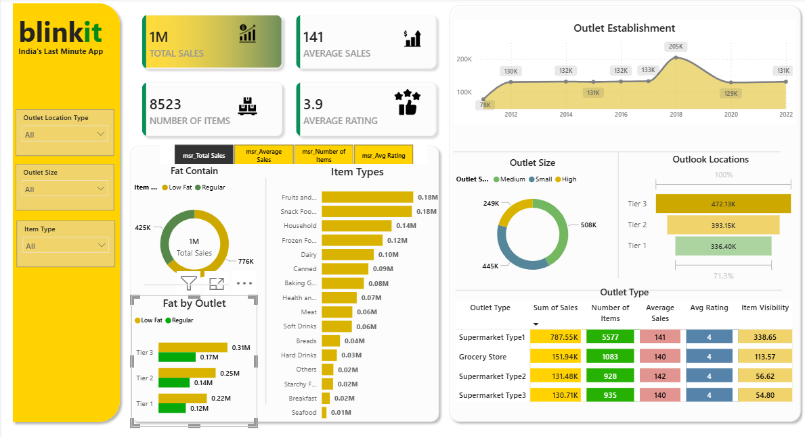

# 🛒 Sales Analysis Dashboard

## 📌 Overview
Developed a Power BI dashboard to analyze retail sales performance, customer ratings, and outlet trends.

## 🛠 Tools Used
- Power BI
- DAX
- Excel

## 📂 Dataset Information
- Source: Kaggle 
- Key Fields: Sales, Outlet Size, Location, Product Category  

## 📊 Key Metrics
- Total Sales  
- Average Sales  
- Number of Items  
- Customer Ratings  

## 📈 Key Insights
- Sales trends vary across outlet sizes and locations  
- Tier-based analysis shows performance differences  
- Product category significantly impacts sales  
- Outlet-level insights highlight top-performing locations  

## 📷 Dashboard Preview

## 🚀 Outcome
Enabled data-driven retail decisions through KPI tracking and performance insights.
