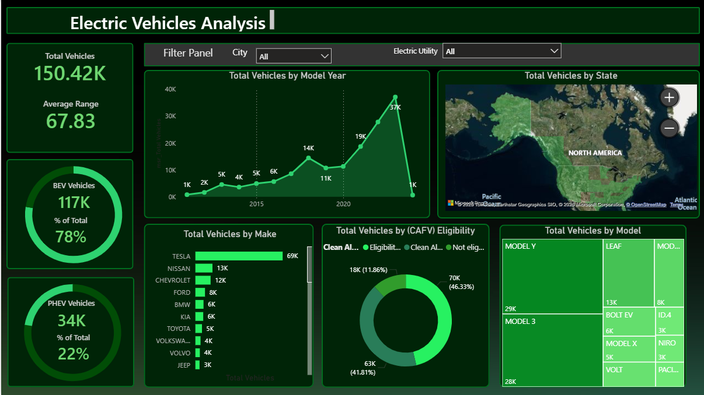

# ⚡ Electric Vehicles Analysis Dashboard

## 📌 Overview
Built a Power BI dashboard to analyze EV market trends, adoption growth, and manufacturer performance.

## 🛠 Tools Used
- Power BI
- DAX
- Excel

## 📂 Dataset Information
- Source: Public EV Dataset  
- Size: 150K+ vehicle records  
- Key Fields: Vehicle Type, Manufacturer, Range, Location  

## 📊 Key Metrics
- Total Vehicles: 150K+  
- BEV Share: 78%  
- PHEV Share: 22%  
- Average Electric Range  

## 📈 Key Insights
- Rapid growth in EV adoption over recent years  
- Tesla leads the EV market, followed by Nissan and Chevrolet  
- Strong distribution of EVs across key regions  
- High CAFV eligibility indicates clean energy adoption  

## 📷 Dashboard Preview

## 🚀 Outcome
Provided insights into EV market trends and supported analysis of clean energy adoption.
