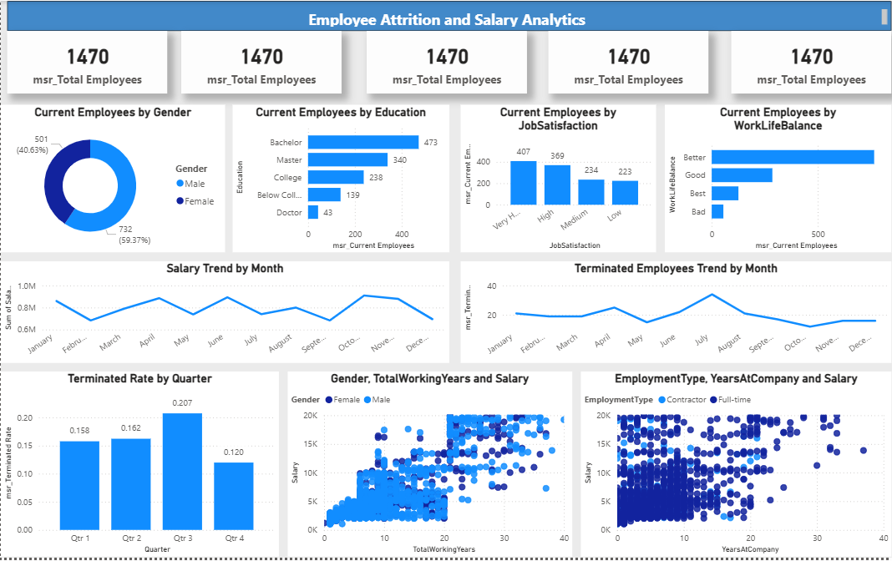

# 👨‍💼 Employee Attrition & Salary Analytics

## 📌 Overview
Built an HR analytics dashboard to analyze employee attrition, salary trends, and workforce distribution.

## 🛠 Tools Used
- Power BI
- DAX
- Excel

## 📂 Dataset Information
- Source: HR Dataset  
- Size: 1470 employee records  
- Key Fields: Age, Salary, Job Role, Attrition, Satisfaction  

## 📊 Key Metrics
- Total Employees: 1470  
- Attrition Rate  
- Salary Trends  
- Job Satisfaction & Work-Life Balance  

## 📈 Key Insights
- Attrition varies significantly by department and role  
- Salary and tenure impact employee retention  
- Job satisfaction influences turnover  
- Workforce distribution shows key HR patterns  

## 📷 Dashboard Preview

## 🚀 Outcome
Supported HR decision-making by identifying key factors affecting employee retention.
