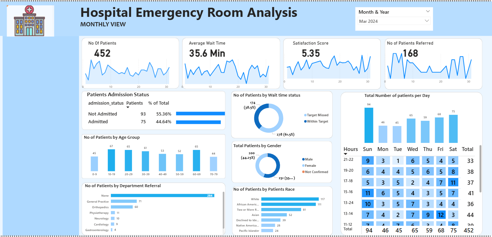

# 📊 Hospital Emergency Room Analysis

## 📌 Overview
Developed an interactive Power BI dashboard to analyze emergency room operations, patient flow, and service efficiency.
## 🛠 Tools Used
Power BI / Excel / SQL

## 📊 Key Metrics (Monthly View)

 • Total Patients: 452
 • Average Wait Time: 35.6 mins
 • Satisfaction Score: 5.35
 • Patients Referred: 168

## 📈 Insights

 • Majority of patients were not admitted (~55%), highlighting ER as a primary treatment point
 • 61.5% patients served within target wait time, while improvement scope remains
 • Patient distribution analyzed by age group, gender, and race
 • Peak patient flow identified through daily and hourly trends
 • Department referrals show General Practice as the highest contributor
## 📷 Dashboard

## 🚀 Outcome
📈 This dashboard provides a clear view of hospital performance, patient experience, and operational efficiency,
helping stakeholders make data-driven healthcare decisions.
