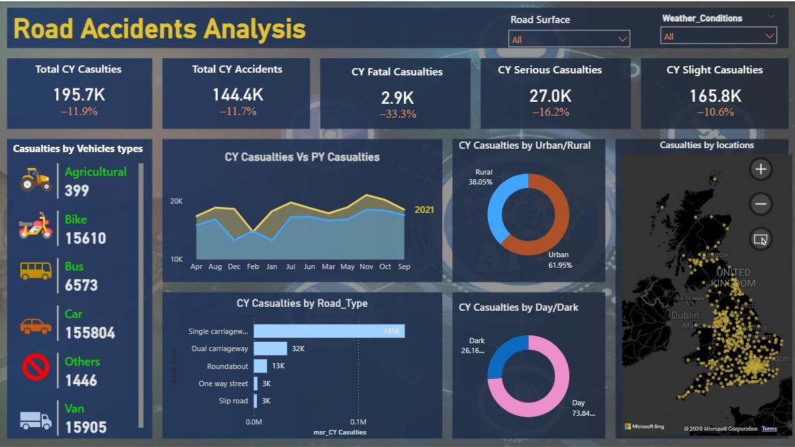

# 🚗 Road Accidents Analysis Dashboard

## 📌 Overview
Built an interactive Power BI dashboard to explore road accident patterns, casualty trends, and key risk factors. The project focuses on analyzing accident data to support better road safety decisions and policy planning.

---

## 🛠 Tools Used
- Power BI  
- DAX  
- Excel  

---

## 📂 Dataset Information
- Source: Road Safety Dataset  
- Size: 140K+ accident records  
- Key Fields: Accident Date, Vehicle Type, Road Type, Weather Condition, Casualties  

---

## 📊 Key Metrics
- Total Casualties: 195.7K  
- Total Accidents: 144.4K  
- Fatal Casualties: 2.9K  
- Serious Casualties: 27.0K  
- Slight Casualties: 165.8K  

---

## 📈 Key Insights
- Year-over-year comparison highlights changes in accident trends  
- Majority of casualties are slight, indicating lower severity incidents  
- Urban areas show higher accident frequency than rural areas  
- Night-time conditions increase accident risk due to low visibility  
- Road type and weather conditions significantly impact accident occurrence  

---

## 📊 Dashboard Features
- Year-over-year trend analysis (Current vs Previous Year)  
- Casualty breakdown by vehicle type and road type  
- Urban vs rural accident distribution analysis  
- Day vs night condition comparison  
- Geographic visualization of accident locations  
- Interactive filters for road surface and weather conditions  

---

## 📷 Dashboard Preview

---

## 🎯 Outcome
This dashboard provides actionable insights into accident patterns and contributing factors, helping stakeholders improve road safety and make data-driven decisions.

---

## 👨‍💻 Author
Mamun Ashraf
